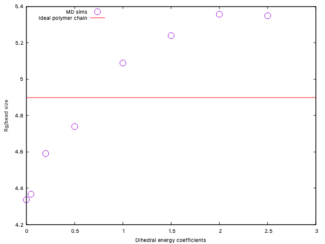

## Effect of dihedral parameters ##
Simulation results for the heparin CG model (chain of 24 beads) employing different values of the coefficients of the multi harmonic dihedral potential style in LAMMPS.

In all cases the 5 terms of the multiharmonic potential are considered equal. The values considered go from 0 (no dihedral) to 2.5 (in LJ energy units). For each case we compute the equilibrium value of the radius of gyration of the polymer.

- The folder *model1* shows an example calculation with all dihedral coefficients equal to 1, including all rwa data from the simulation and analysis.
- The other foleders include only the input files and the esult for the radius of gyration. 

The value of the dihedral potential has a substantial impact on the radius of gyration, increasing from 4.3 times the size of a bead for no dihedral to a limite value of 5.35 for dihedral coefficients above 2:

